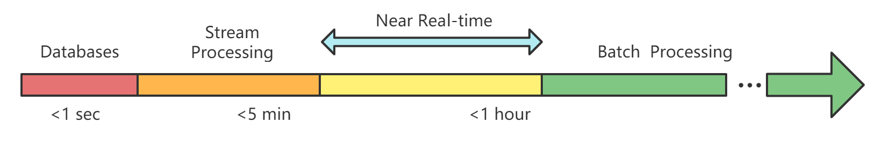
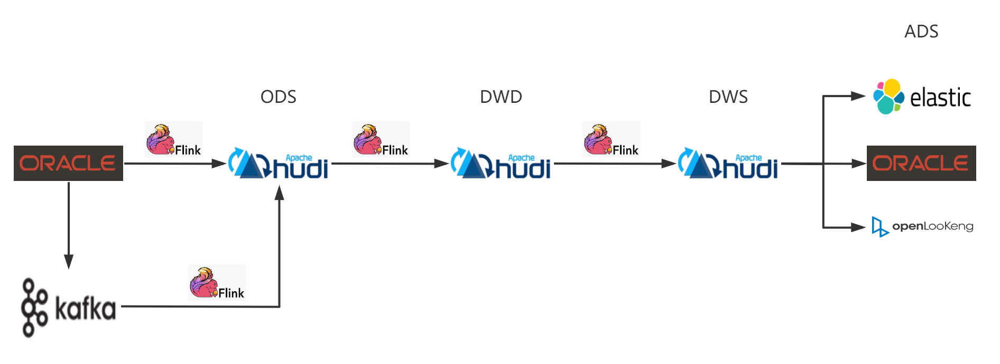

<div align='center' ><font size='6'>使用flink on hudi构建准实时的流式数据湖</font></div>
### 准实时
 
   * MR/Spark 的批处理模型，用户可以实现小时级别的数据注入 HDFS/OSS;
   * Flink + KV/OLAP 存储的架构可以实现端到端的秒级 (5分钟级) 实时分析;

<div align="center"></div>

然而在秒级 (5分钟级) 到小时级时的场景还存在大量的用例，我们称之为 NEAR-REAL-TIME (准实时)。在实践中有大量的案例都属于近实时的范畴：
   * 分钟级别的大屏；
   * 各种 BI 分析 (OLAP)
   * 机器学习分钟级别的特征提取。
### 技术选型
|对比项|Hudi|Iceberg|
|:-:|:-:|:-:|
|功能丰富度|丰富|待提升|
|Flink集成|是|是|
|社区活跃度|活跃|相对活跃|
从已发布的版本来看，Iceberg代码架构，扩展性相比于Hudi更好一些，但是很多功能，比如行级删除，都还在开发的路上；Hudi功能比较丰富，可以满足我们当前的需求，并且社区比较活跃，我们可以获得社区的帮助。
### 
##### 增量ETL（以数据库入湖为例）
Hudi已经集成了流写，流读的能力，用户可以通过 Flink SQL 将 CDC 数据实时写入 Hudi 存储:
<div align="center"></div>
这套架构将端到端的 ETL 时延缩短到分钟级，并且每一层的存储格式都可以通过 compaction 压缩成列存（Parquet、ORC）以提供 OLAP 分析能力，由于数据湖的开放性，压缩后的格式可以对接各种查询引擎：Flink、Spark、Presto、Hive 等。

##### 演示
以融合数据湖平台实时入湖模块中的作业列表为例，该列表中的数据由两张表关联出来的，分别为job表和warehourse表；
**job表**
|job_id|job_name|warehource_id|compute_engine|inport_type|...|
|:-:|:-:|:-:|:-:|:-:|:-:|
|1|job1|w1|spark|0|...|
|2|job2|w12|flink|1|...|
|3|job3|w13|spark|1|...|

**warehourse表**
|warehourse_id|warehourse_name|...|
|:-:|:-:|:-:|
|1|w1|...|
|2|w2|...|
第一步：
> job表和warehourse表中的数据是在Oracle中存储，需要将此数据通过AR接入到Kafka中；

第二步：
> 使用flink sql对接Kafka，实时获取表中的数据
```sql
```
第三步：
> 将接收到的实时数据存放到hudi中
```sql
```
第四步：
> 获取job表和warehouse表关联结果（为了展示flink on hudi的实时处理功能，我们这里将关联结果存放在hudi中，前端业务直接查询hudi中的结果表）

```sql
```
第五步：
> 查询结果集：