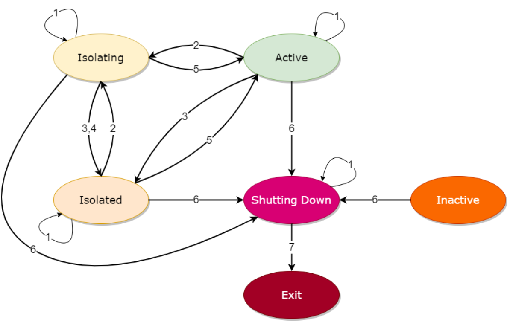

可以基于以下两点去动态扩缩容：
* 系统监控，例如 CPU、内存和 I/O
* 节点工作负载状态

可以通过调用 API 来获取有关特定节点的工作负载信息，包括 CPU、内存分配和使用信息。 返回详细信息可以参考io.prestosql.server.NodeStatus class.
例如：
`$ curl http://1.2.3.4:8080/v1/status | jq`
```
{
  "nodeId": "...",
  ...
  "memoryInfo": {
    "availableProcessors": ...,
    "totalNodeMemory": "...",
    ...
  },
  "processors": ...,
  "processCpuLoad": ...,
  "systemCpuLoad": ...,
  "heapUsed": ...,
  "heapAvailable": ...,
  "nonHeapUsed": ...
}
```
#### 节点状态管理API

##### Shutdown 
`$ curl -X PUT -H "Content-Type: application/json" http://1.2.3.4:8080/v1/info/state 
    -d '"SHUTTING_DOWN"'`
* 集群不会向该节点分配新的工作负载 
* 节点尝试在关闭其主进程之前完成所有现有工作负载 
* 该操作是不可逆转的

##### Isolate 
```
# To gracefully isolate a node
$ curl -X PUT -H "Content-Type: application/json" http://1.2.3.4:8080/v1/info/state \
    -d '"ISOLATING"'

# To isolate a node immediately
$ curl -X PUT -H "Content-Type: application/json" http://1.2.3.4:8080/v1/info/state \
    -d '"ISOLATED"'

# To make the node available again
$ curl -X PUT -H "Content-Type: application/json" http://1.2.3.4:8080/v1/info/state \
    -d '"ACTIVE"'
```
* 等待工作负载先完成,在此等待期间的节点处于Isolating状态；
* 也可以直接进入isolated状态；
* 处于Isolating和isolated状态的节点不会被分配新的工作负载 
* 该操作是可逆的；

#### 状态图
<div align="center"></div>