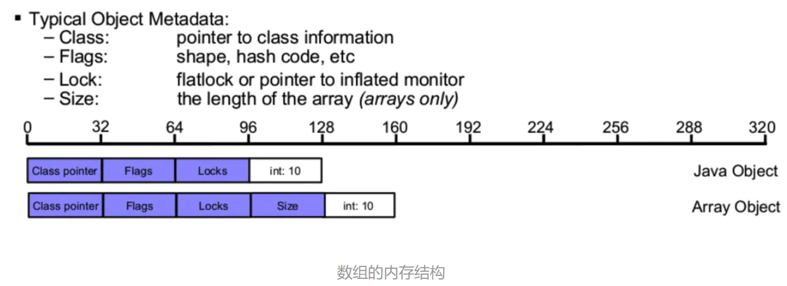
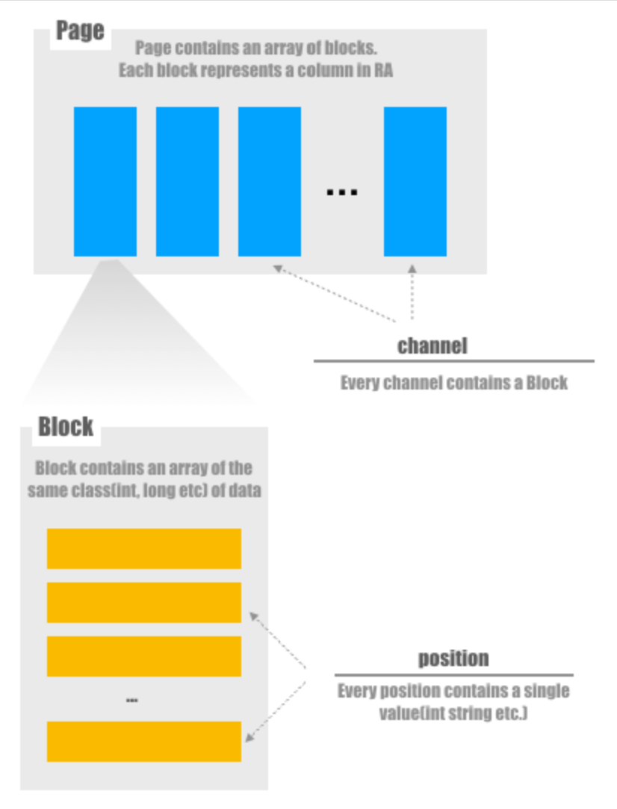

#### 核心数据结构：Slice、Page、Block
##### Slice
Slice是Presto里面用来对内存高效地、自由地进行操作的接口
Slice里面是通过三个参数来确定一个内存地址: base , address , size 。

* base 是通过JVM分配出来的内存，在JVM层面是int数组、byte数组的对象，而对Slice来说这就是我们要操作的内存块。
* address 是我们要操作的地址离 base 这个对象头的偏移量.
* size 是我们这块内存的大小，一般来说就是 base 底层所对应的内存的大小(in bytes), 或者更小一点。
  
例：基于 byte[] 来创建一个Slice的构造函数
```java
    Slice(byte[] base)
    {
        requireNonNull(base, "base is null");
        this.base = base;
        this.address = ARRAY_BYTE_BASE_OFFSET;
        this.size = base.length;
        this.retainedSize = INSTANCE_SIZE + sizeOf(base);
        this.reference = COMPACT;
    }
```
其中 base 就是这个 byte数组, address 是一个来自 Unsafe 类里面常量: ARRAY_BYTE_BASE_OFFSET ，这个常量表示的是: byte数组里面第一个元素的地址离整个byte数组地址头的偏移量。为什么会有这么一个偏移量？因为数组不止有裸的byte数据，还有一些元数据在这些真正的数据之前，一个数组在JVM里面的元数据的结构如下:
<div align="center"></div>
由上图可见JVM数组的元数据有 class pointer , flags , locks , 以及一个数组的长度 size 一共是 128 位，也就是 16 个 byte, 而 ARRAY_BYTE_BASE_OFFSET 正好是 16, 意思是说从 byte[] 对象的首地址偏移 16 个字节才是真正开始保存数据的地方。

##### Block
由于 Page 由 Block 组成，因此我们首先介绍 Block。Block 可以认为是同一类数据（int，long，Slice等）的数组。每个数据项都有一个 position，总位置个数代表 Block 中数据的总行数（Block 仅保存这些行中的一列）。
<div align="center"></div>

Block可以理解为Page中的一个column，blockbuilder是用的builder设计模式来构建block的。不同的数据类型写block的方式是调用他们自己的write方法，如Bigint::write。读取block的可以通过position(可以理解为row id)来做，仍然用具体的数据类型class来操作。